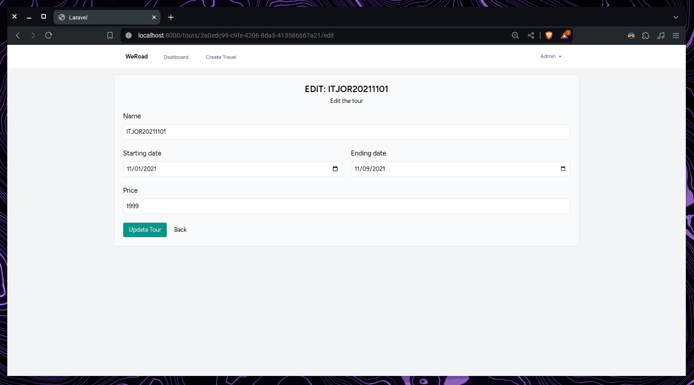

# weRoad-laravel
The project is a demo platform that allows users to view related trips and tours. Implements an authentication system with two roles: Admin and Editor. Users have access to specific features based on their assigned role.
The project have over than 70 tests and have over 120 assertions and uses Lint and Static Analysis tools.

## Index 
- [weRoad-laravel](#weroad-laravel)
  - [Index](#index)
    - [Requirements](#requirements)
  - [Installation](#installation)
    - [Packages](#packages)
  - [Description](#description)
    - [Access data for roles](#access-data-for-roles)
    - [Seeders e Factories](#seeders-e-factories)
  - [API Endpoints](#api-endpoints)
    - [Routes Accessible Without Authorization](#routes-accessible-without-authorization)
    - [Routes Accessible only by Admin and only if Authenticated](#routes-accessible-only-by-admin-and-only-if-authenticated)
    - [Routes Accessible only by Editor and only if Authenticated](#routes-accessible-only-by-editor-and-only-if-authenticated)
      - [Endpoint parameters](#endpoint-parameters)
  - [Controllers](#controllers)
  - [Database](#database)
    - [Models and Migrations](#models-and-migrations)
    - [User](#user)
    - [Travel](#travel)
    - [Tour](#tour)
  - [Frontend](#frontend)
  - [Tests](#tests)
  - [Other](#other)

### Requirements

- PHP 8.2+
- Composer
## Installation

1. Clone the repository and open the repository on your IDE
2. With terminal, move on `/weRoad`
3. Run `composer install` to install the necessary dependencies
4. Run `npm install` to install node_modules dependencies
5. Run `npm run build` to make the build of the project
6. Run `php artisan migrate --seed` to populate the database with mock data.
   - The cmd will ask you to create a database. respond yes 
7. Run `php artisan serve` to  start the application on port 8000. Then open your browser on http://localhost:8000  

ps. If you have problem on build or serve, delete the node_modules and package-lock.json and rerun npm install
### Packages

- **Laravel Breeze**: For authentication
- **Faker**: For seeding data into the database
- **Pint**: A Lint for formatting code
- **Pest**: A library for testing
- **Larastan**: A Static code analysis tool
## Description

The project uses SQLite as a supporting database, eliminating the need to create a separate database. Authorization authentication assigns specific functionality based on the user's role.

### Access data for roles

Login data has been created for users with predefined roles:

1. Admin: `admin@gmail.com` with password `password`
2. Editor: `editor@gmail.com` with password `password`

Access data are managed in the file `/database/seeders/DatabaseSeeder.php`.
### Seeders e Factories
Factories have been created for each model, these are used in the seeder database to fill the database with mock data. 

- **Admin**:
    - Create a Travel
    - Create a Tour associated with a Travel
    - Delete a Travel
    - Delete a Tour
    - Edit a Tour
- **Editor**:
	- Edit a Travel
- **Features for unauthenticated users**:
	- View a paginated list of Travels
	- View the details of a Travel with related tours
	- Filter the tours associated with a Travel through the search fields
***
## API Endpoints
Endpoints are defined in the `routes` folder, managing permissions via middlewares, available at `/app/Http/Middleware`
### Routes Accessible Without Authorization
1. `GET /`: Displays the index of all Travels, paginated.
2. `GET /travels/{slug}`: Displays a single trip and the table of tours associated with it.
### Routes Accessible only by Admin and only if Authenticated
1. `GET /travels/create`: Displays the creation page of a new travel.
2. `POST /travels`: Creates a single travel.
3. `DELETE /travels/{travel}`: Delete a single travel.
4. `GET /travels/{slug}/tours/create`: Displays the creation page of a new tour associated with the travel.
5. `POST /travels/{travel}/tours`: Creates a new tour associated with the travel.
6. `GET /tours/{tour}/edit`: Displays the single tour edit page.
7. `PUT /tours/{tour}`: Edit the tour.
8. `DELETE /tours/{tour}`: Delete the tour.
### Routes Accessible only by Editor and only if Authenticated
1. `GET /travels/{slug}/edit`: View the single travel edit page.
2. `PUT /travels/{slug}`: Edit the travel.
#### Endpoint parameters

1. `{slug}`: represents the slug property of the travel, for example "foo-bar".
2. `{travel}`: It is the ID of the selected travel.
3. `{tour}`: It is the ID of the selected tour.
***
## Controllers
Controllers manage the actions that can be called from endpoints. In addition to the controllers that manage authentication, located in the path `/app/Http/Controllers/Auth`, and the `ProfileController.php` controller, responsible for managing the user's profile, there are:
1. **TourController.php**: It deals with the CRUD management of the Tours.
2. **TravelController.php**: It deals with the CRUD management of Travel. Additionally, it contains a private method to apply search filters to the individual Travel's GET path.
*** 
## Database
SQLite is used as a database, entity models are created by creating migrations for individual entities.
### Models and Migrations
All entities use a UUID as their primary key
all models properties are mandatory and the models are:
### User
- `id`: UUID, Primary Key
- `name`: string
- `email`: string, unique
- `password`: string (criptata alla registrazione)
- `role`: integer (basato sul enum `UserRole`)
### Travel
- `id`: UUID, Primary Key
- `slug`: string, unique
- `name`: string
- `name`: text
- `numberOfDays`: integer
- `moods`: Json Object
- `isPublic`: boolean
### Tour
- `id`: UUID, Primary Key
- `name`: string
- `startingDate`: Date
- `endingDate`: Date
- `price`: float
- `travelId`: UUID, Foreign Key di Travels
*** 
## Frontend
The frontend is Blade based with views split into folders per domain, using components from the `components` folder. Views have elements that are visible using `@can` directives which allows you to show something based on a check on the middlewares.
***
## Tests
The tests are built using **Pest**, a PHP framework for unit testing.
Most of the tests are of the Feature type which deal with testing the functioning of the app's features.

To run the tests use the `php artisan test` command and all the tests will be executed completely.

The tests cover the functionality of:
- Authentication
- Route authorization
- Features on dashboard page
- Features on the travel page

## Other
- The project uses **Pint** as the linter, to run it just use the command `./vendor/bin/pint`.
- The project use **Larastan** as static code analysis tool with level 5. To run it just use the command `./vendor/bin/phpstan analyse`
